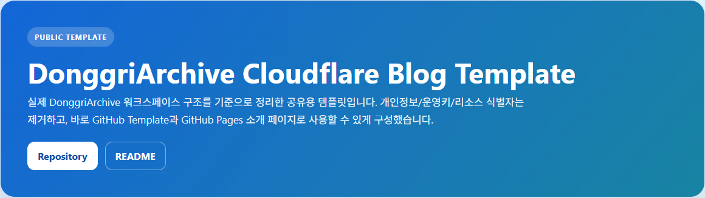
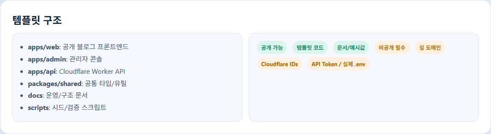
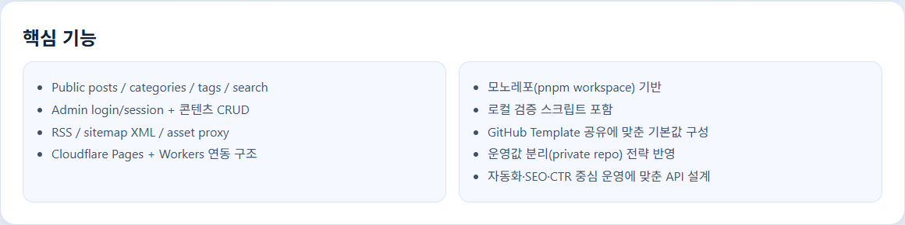
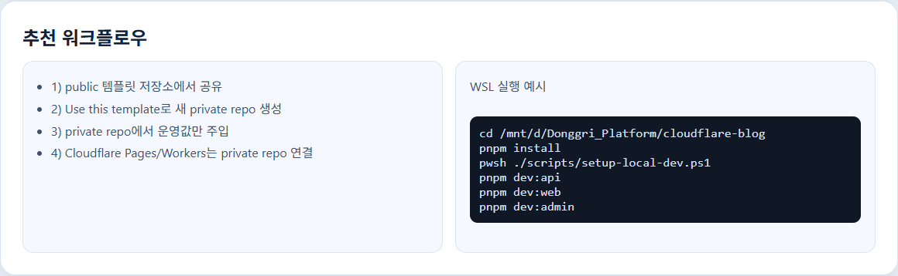
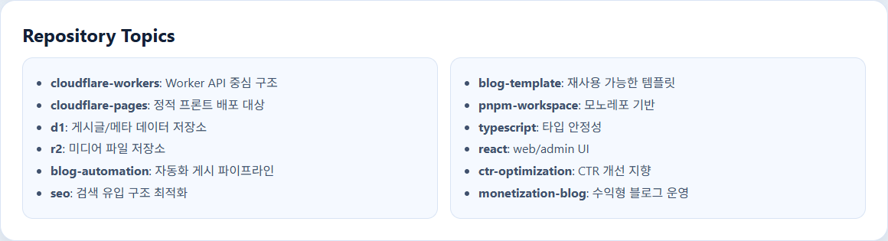
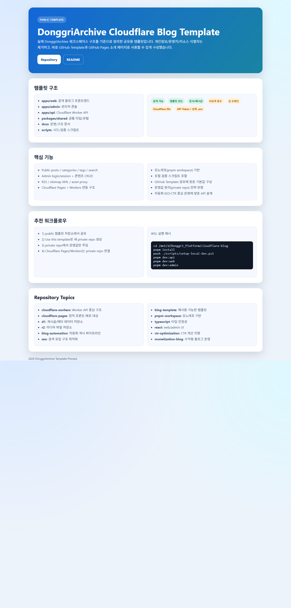

# DonggriArchive Cloudflare Blog Template

DonggriArchive 기반 구조를 템플릿으로 정리한 공개 저장소입니다.  
개인/운영 정보는 제거했고, 템플릿 공유와 GitHub Pages 소개 페이지에 바로 사용할 수 있습니다.

- Repository: [https://github.com/sheryloe/cloudflare-blog](https://github.com/sheryloe/cloudflare-blog)

---

## 1. 템플릿 미리보기

> 아래 이미지는 루트 `index.html`을 파트별로 캡처한 화면입니다.

### Hero


### Structure


### Features


### Workflow


### Topics


### Full Page


---

## 2. 포함된 실제 템플릿 구성

```text
cloudflare-blog/
├─ apps/
│  ├─ web/            # 공개 블로그 프론트엔드
│  ├─ admin/          # 관리자 콘솔
│  ├─ api/            # Cloudflare Worker API
│  ├─ blog-web/       # 신규 웹 앱 라인
│  └─ editor-local/   # 로컬 콘텐츠 편집 라인
├─ packages/
│  └─ shared/         # 공통 타입/유틸
├─ docs/              # 운영 문서
├─ scripts/           # 시드/검증/자동화 스크립트
├─ functions/         # 배포 보조 함수
├─ index.html         # GitHub Pages 랜딩
└─ README.md
```

---

## 3. 포지셔닝 (자동화 + SEO + CTR)

이 템플릿은 단순 블로그 스켈레톤이 아니라, **자동화 운영형 수익형 블로그** 구조를 전제로 설계했습니다.

- 자동화 게시 파이프라인: `admin upsert-by-slug`, `blogger compat`, `integrations`
- SEO 기본기: sitemap/RSS/metadata/slug/카테고리·태그 구조
- CTR 관점: 제목/요약/커버 이미지/관련 링크를 API 레벨에서 일관 관리
- 운영 안정성: CORS allowlist, rate-limit, 세션/자동화 키 분리
- 템플릿-운영 분리: 공개 저장소는 코드만, 운영값은 private 저장소에서 관리

---

## 4. 템플릿 공개/운영 분리 원칙

### 공개 저장소(public) 유지 항목

- 앱 구조/코드/문서
- `.env.example`, `.dev.vars.example`
- README, 소개 페이지, 예시 스크린샷

### 비공개 저장소(private)로 분리할 항목

- 실제 도메인/서브도메인
- Cloudflare account/project/resource 식별자
- D1/R2 실제 이름 및 ID
- API Token, OAuth Secret
- 실 운영 `.env`, `.dev.vars`
- 분석/검증 ID (GA, Search Console, Naver 등)

---

## 5. WSL 기준 실행 방법

### 환경

- WSL2 (Ubuntu)
- Node.js 20+
- Corepack 활성화
- pnpm 10+
- PowerShell 7 (`pwsh`)

### 실행

```bash
cd /mnt/d/Donggri_Platform/cloudflare-blog
corepack enable
pnpm install
pwsh ./scripts/setup-local-dev.ps1

pnpm dev:api
pnpm dev:web
pnpm dev:admin
```

### 선택 실행 (신규 라인)

```bash
cd /mnt/d/Donggri_Platform/cloudflare-blog
pnpm dev:blog
pnpm dev:editor
```

### Docker 백그라운드 실행 (`testdocker`)

```bash
cd /mnt/d/Donggri_Platform/cloudflare-blog/testdocker
docker compose -f compose.yaml up -d --build
```

접속:

```text
http://localhost:8090
```

---

## 6. GitHub Template + Pages 설정

### GitHub Template

1. 저장소 `Settings` → `General`
2. `Template repository` 활성화
3. 사용자들이 `Use this template`로 새 저장소 생성

### GitHub Pages

1. 루트 `index.html` 유지
2. `Settings` → `Pages`
3. Source: `Deploy from a branch`
4. Branch: `main` / `(root)`
5. 배포 URL 생성 확인

---

## 7. Repository Topics (태그) 권장값

아래 토픽을 `https://github.com/sheryloe/cloudflare-blog`에 설정하면 템플릿 검색성과 설명력이 좋아집니다.
정리 파일: `.github/repository-topics.md`

- `cloudflare-workers`: API 레이어가 Worker 기반
- `cloudflare-pages`: 정적 웹/관리자 페이지 배포
- `d1`: 게시글/분류 데이터 스토리지
- `r2`: 미디어 파일 스토리지
- `blog-template`: 재사용 목적의 블로그 템플릿
- `pnpm-workspace`: 모노레포 패키지 구성
- `typescript`: 타입 안정성 기반 코드
- `react`: web/admin UI 레이어
- `blog-automation`: 자동화 게시 파이프라인
- `seo`: 검색엔진 최적화 기반 구조
- `ctr-optimization`: 클릭률 최적화 운영 모델
- `monetization-blog`: 수익형 블로그 운영 지향

---

## 8. API 문서

- 메인 API 문서: `docs/worker_api.md`
- cURL 예시: `docs/api-command-examples.html`
- 앱별 API 개요: `apps/api/README.md`

---

## 9. 템플릿 복제 후 체크리스트

1. private 저장소 생성 후 운영값 주입
2. 실 리소스(D1/R2/Pages/Workers) 새로 생성
3. `.env` / `.dev.vars` 커밋 금지 확인
4. 운영 배포는 private 저장소에서만 수행
5. 공개 저장소에는 템플릿 코드만 유지
